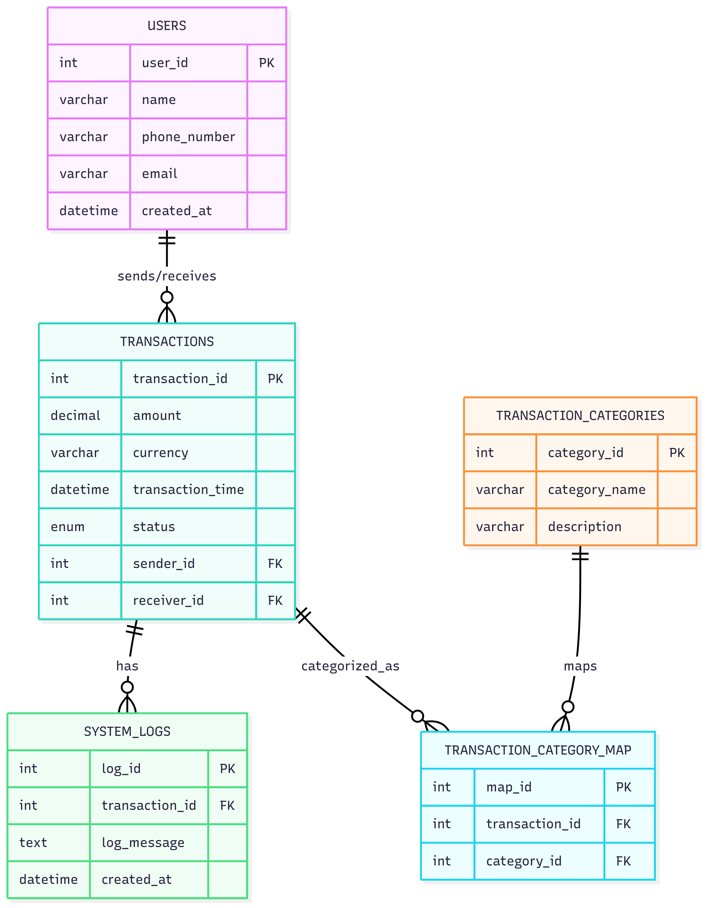

# MoMo SMS Dashboard
This project processes MoMo SMS transaction data (from XML), cleans and categorizes it, stores it in a relational database (MySQL), and provides both a JSON API (FastAPI) and a frontend dashboard for visualization.

## Team Name
Group 3

## Project Description
This project is an enterprise-level fullstack application designed to process MoMo SMS data in XML format. The system will parse, clean, and categorize transactions, store them in a relational database (SQLite), and provide a frontend dashboard for analysis and visualization.  

## Team Members
- King Abejirin  
- Teta Loice  
- Arnold MUGABO
- Mwizera Gisele  

## Scrum Board
[View our Scrum Board](https://github.com/users/Abejirin-King/projects/1)  

## Project Structure
    ```bash
    .
    ├── README.md  
    ├── .env.example  
    ├── requirements.txt  
    ├── index.html
    ├── web/  
    │   ├── styles.css  
    │   ├── chart_handler.js  
    │   └── assets/  
    ├── data/  
    │   ├── raw/  
    │   ├── processed/  
    │   ├── db.sqlite3        
    │   └── logs/  
    ├── docs/  
    │   ├── erd_diagram.png  
    │   └── design_doc.pdf   
    ├── database/  
    │   └── database_setup.sql 
    ├── examples/  
    │   └── json_schemas.json 
    ├── etl/  
    │   ├── __init__.py  
    │   ├── config.py  
    │   ├── parse_xml.py  
    │   ├── clean_normalize.py  
    │   ├── categorize.py  
    │   ├── load_db.py  
    │   └── run.py  
    ├── api/  
    │   ├── __init__.py  
    │   ├── app.py  
    │   ├── db.py  
    │   └── schemas.py  
    ├── scripts/  
    │   ├── run_etl.sh  
    │   ├── export_json.sh  
    │   └── serve_frontend.sh  
    └── tests/  
        ├── test_parse_xml.py  
        ├── test_clean_normalize.py  
        └── test_categorize.py

## System Architecture

[View Our System Architecture](https://drive.google.com/file/d/1qUXtZGYu5cMayS05mjYsiglbUd0TFMkN/view?usp=sharing)



## Setup
1. Clone this repo:  
   ```bash
   git clone https://github.com/your-team/momo-sms-dashboard.git
   cd momo-sms-dashboard

2. Copy environment variables:
   ```bash
   cp .env.example .env

3. Install dependencies:
   ```bash
   pip install -r requirements.txt

4. Create virtual Environment
   ```bash
   python -m venv venv
   source/venv/bin/activate #On linux and mac
   venv\Scripts\activate #On windows
   
5. Setup Database
Make sure MySQL is installed and running.
Create the database:
   ```bash
   CREATE DATABASE momo_db

6. Load schema:
   ```bash
   mysql -u root -p momo_db < database/database_setup.sql

7. Running the ETL Pipeline
Parse XML → clean → load into DB:
   ```bash
   python etl/run.py --xml data/raw/momo.xml

8. Running the API
   ```bash
   uvicorn api.app:app --reload


Visit:
http://127.0.0.1:8000
 → API root
http://127.0.0.1:8000/docs
 → Swagger API docs

## Example Endpoints

- / → API health check
- /users → List all users
- /transactions → List transactions
- /analytics/summary → Transaction summary (total deposits, withdrawals, etc.)


